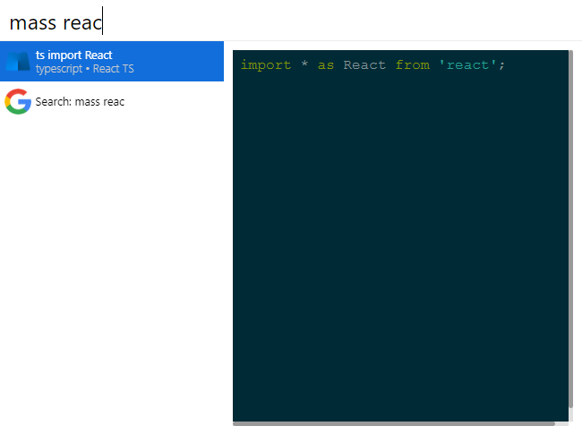

# cerebro-masscode

> [Cerebro](http://www.cerebroapp.com) plugin for massCode

## Usage

In Cerebro, type `mass something` to find snippet, like `mass import react`. Use <kbd>↩</kbd> for copy.

## Related

- [Cerebro](http://github.com/KELiON/cerebro) – main repo for Cerebro app;
- [cerebro-plugin](https://github.com/KELiON/cerebro-plugin) – boilerplate to create plugins for Cerebro app

## License

MIT © Dmitry Voronin
